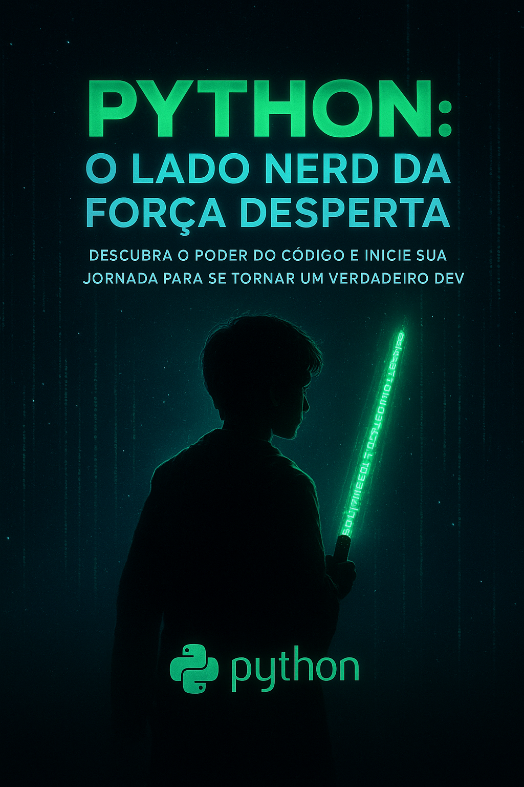

   

-------

# Projeto EBOOK Gerado por I.A.s

 > ℹ️ **NOTE:** Este é o repositório que criei durante o curso Fundamentos de IA Generativa na plataforma da DIO

Projeto com o objetivo de gerar um ebook digital com as facilidades das ferramentas de IA. todos os prompts
seguem abaixo.

<a href="https://github.com/ism-dev-codes/prompts-recipe-to-create-a-ebook/blob/main/output/Python%20O%20Lado%20Nerd%20da%20For%C3%A7a%20Desperta.pdf" title="View PDF now"> 📕Clique aqui para ler</a>

## 💻 Tecnologias utilizadas no projeto

- [ChatGPT](https://chat.openai.com/) 
- [MidJourney](https://www.midjourney.com/app/)
- [Canva](https://www.canva.com/pt_br/)

## 🧠 Prompts

ChatGPT：

|   Ação   | prompt                                                                                                                                                                                                                                                                         |
| :------: | ------------------------------------------------------------------------------------------------------------------------------------------------------------------------------------------------------------------------------------------------------------------------------ |
|  título  | Crie um título de um ebook sobre python, o ebook é do nicho de programação e o sub-nicho é de python, o título deve ser épico e curto, e tenha uma temática mais nerd inspirado na franquia star wars. Me liste 5 sugestões de título e subtítulo. |                                                        |
| conteúdo | Você é uma autoridade em programação especializado na linguagem python. Você também é um especialista em criação de ebooks. Dito isso, crie um ebook, com foco em python. E o nome do ebook é: Python: O Lado Nerd da Força Desperta. Regras: Público alvo deste ebook são iniciantes da linguagem python. O Ebook tem que ter toda a temática nerd, inspirado na franquia star was. O ebook tem que ter índice. O ebook têm que ter folhas divisórias de capítulos com o número de cada capitulo e tema do capito. O ebook tem que ter 5 projetos baseados em star wars para os leitores criaram. O ebook tem que ter conclusão incentivando os leitores a continuar se desenvolvendo na linguagem python. Estilo minimalista. O Ebook tem que ter a mesma paleta de cores da capa que criamos e seguir o mesmo padrão da diagramação de um ebook profissinal. Regras negativas: O ebook não pode usar temos difíceis de entender. O ebook não pode ser muito longo. |

Midjourney：

|  Ação  | prompt                                                                                 |
| :----: | -------------------------------------------------------------------------------------- |
| título | ebook cover design for "Python: O Lado Nerd da Força Desperta", cinematic sci-fi style inspired by Star Wars, futuristic coding theme, glowing neon green and blue lights, digital matrix effects, a silhouette of a young Jedi holding a lightsaber made of glowing Python code, space background with stars and data streams, high-tech typography for the title, dramatic lighting, soft shadows, sleek and modern composition, ultra detailed, 8k, epic atmosphere, concept art, trending on ArtStation --ar 2:3 --v 6 --style cinematic --q 2 --no text watermark, no signature |

## ✨ Features

- Conteúdo gerado via ChatGPT
- Imagens geradas via MidJourney

## 📚 Materiais

- Imagens utilizadas em `assets`
- ebook gerado durante as aulas em `output`
- ebook diagramado no Canva

## 🛠️ Instruções de execução

Utilize os prompts acima nas ferramentas sugeridas para gerar o material base e utilize uma ferramenta de edição de documentos como canva, power point, libreoffice , indesign para diagramação.

## 👨‍💻 Expert

    
    
&nbsp&nbsp&nbspIsmael Medeiros 
    &nbsp&nbsp&nbsp
    <a 
        href="https://github.com/ism-dev-codes">
        GitHub
    </a>
    &nbsp;|&nbsp;
    <a 
        href="https://www.linkedin.com/in/ismael-medeiros-5b2bb51ab/">
        LinkedIn
    </a>
    &nbsp;|&nbsp;
    <a 
        href="https://www.instagram.com/ismaelsmedeiros?igsh=YXA1OW1mNXhkNmVy">
        Instagram
    </a>
    &nbsp;|&nbsp;

  

---

⌨️ com 💜 por [Ismael Medeiros](https://www.linkedin.com/in/ismael-medeiros-5b2bb51ab/)
